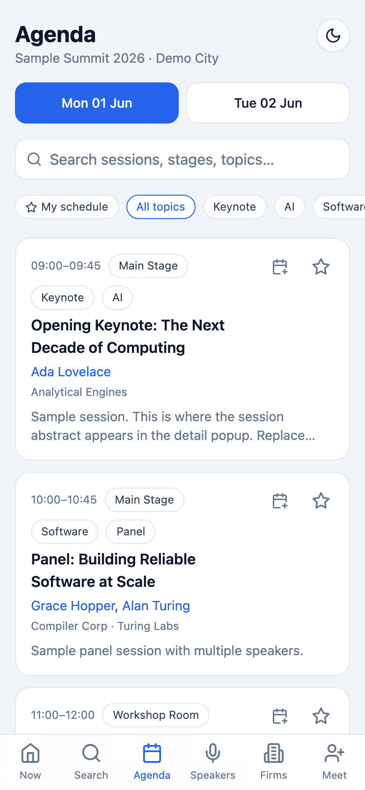
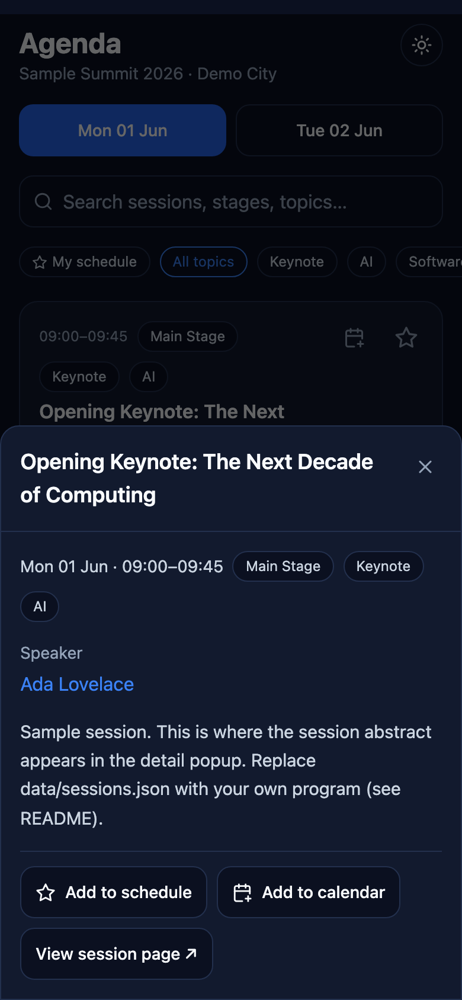
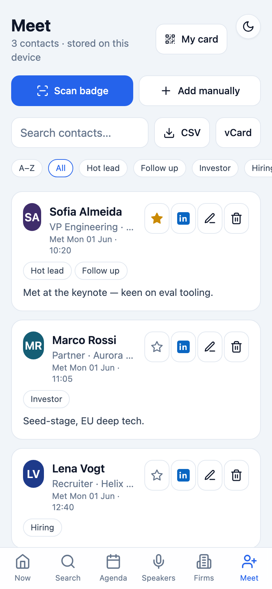

# Lanyard

A private, installable **event companion** (PWA) for a conference or event.
Point it at your own program data and deploy it behind a password in minutes.

It's time-aware (a "happening now / up next" view), works offline, and stores
everything personal — your starred sessions, the people you meet — locally on
the device.

Built with Next.js 16, React 19, and Tailwind. Designed to run on Vercel's free
tier.


<table>
  <tr>
    <td></td>
    <td></td>
    <td></td>
  </tr>
</table>

<sub>Shown with the bundled sample data; light & dark themes included.</sub>

## Contents

- [Features](#features)
- [Quick start](#quick-start)
- [Deploying](#deploying)
- [Importing program data](#importing-program-data)
- [Optional: AI research](#optional-ai-research)
- [Customising branding](#customising-branding)
- [Your data, your responsibility](#your-data-your-responsibility)
- [Contributing](#contributing)
- [Security](#security)
- [License](#license)

## Features

- **Now** — what's live and up next, computed from the current time.
- **Agenda** — full multi-day program with search, topic filters, "my schedule"
  stars, conflict warnings, and one-tap calendar export (`.ics`).
- **Session details** — tap any session for the full abstract, speakers, and a
  link to its page.
- **Speakers & Companies** — browsable, searchable directories with profiles.
- **Search** — across the whole program at once.
- **Meet** — a private, on-device contact list: scan a badge QR or business
  card (on-device OCR), or add people manually; tag them, pin follow-ups to the
  top, and export to CSV or vCard. Nothing leaves the device.
- **Optional AI research** — tap "Research" on a speaker/company/contact to get
  a short, web-searched brief (needs an Anthropic API key; otherwise shows a
  stub).
- **Light & dark** themes, installable to the home screen, offline-friendly.
- **Private by default** — a server-side access gate (HTTP Basic Auth) keeps the
  whole app, including its data, behind a password.

## Quick start

```bash
npm install
cp .env.example .env.local      # then set APP_ACCESS_PASSWORD
npm run dev                     # http://localhost:3000 (you'll be prompted to log in)
```

The repo ships with **sample data** so it runs immediately. Then make it yours:

### 1. Configure your event

Edit [`event.config.ts`](./event.config.ts) — name, short name, tagline, city,
timezone, the list of days, and your website. The timezone must match the UTC
offsets in your session data.

### 2. Add your program data

Replace the files in [`data/`](./data) with your event's content. The shapes
are defined in [`lib/types.ts`](./lib/types.ts):

- `data/sessions.json` — `Session[]` (title, `start`/`end` ISO times **with
  offset**, stage, tags, `speakerIds`, `orgIds`, optional `description` and
  `sourceUrl`).
- `data/speakers.json` — `Speaker[]` (name, title, company, `orgId`, topics,
  bio, optional `photo` URL).
- `data/organizations.json` — `Organization[]` (name, `type`, tagline, website,
  booth, topics).
- `data/research.json` — `{}` to start; AI dossiers (if enabled) are generated
  on demand.

IDs are arbitrary strings but must line up (`speakerIds`/`orgIds` reference the
`id`s in the other files).

### 3. Set the access password

The app is private and stays locked (HTTP 503) until you set a password:

```
APP_ACCESS_USER=guest
APP_ACCESS_PASSWORD=your-secret
```

Set these in `.env.local` for local dev and in your host's environment for
production. Share the user + password with whoever you want to let in.

### 4. Deploy

See **[Deploying](#deploying)** below.

## Deploying

**This app needs a host that runs Next.js server-side** — it isn't a static
site. The access gate (`proxy.ts`) runs as Next middleware, and the optional
research endpoint is a server route. So **static-only hosts won't work**
(GitHub Pages, plain S3/CDN, `next export`): the gate wouldn't run and the data
would be served unprotected.

You also want **HTTPS** in production — the camera (badge QR/OCR scanning) and
PWA install/service worker only work over HTTPS (or `localhost` in dev).

### Recommended: Vercel

Vercel is made by the Next.js team, runs the middleware/proxy and API routes
with zero config, gives automatic HTTPS and a generous free tier, and makes env
vars and custom domains easy. It's the path of least resistance here.

1. Push this repo to GitHub/GitLab/Bitbucket.
2. On [vercel.com](https://vercel.com) → **Add New → Project** → import the repo
   (framework auto-detects as Next.js).
3. **Settings → Environment Variables**, add:
   - `APP_ACCESS_USER` (e.g. `guest`)
   - `APP_ACCESS_PASSWORD` (your secret) — **required**
   - optionally `ANTHROPIC_API_KEY`, `RESEARCH_MODEL`, `NEXT_PUBLIC_GROUP_CODE`
4. **Deploy.** Open the URL — your browser prompts for the user/password.
5. (Optional) add a custom domain under **Settings → Domains**.

> The gate **fails closed**: until `APP_ACCESS_PASSWORD` is set, every request
> returns HTTP 503. If you see that after deploy, you haven't set it (or need to
> redeploy after adding it).

For a CLI alternative and an on-phone test checklist, see **[DEPLOY.md](./DEPLOY.md)**.

### Other hosts that work

Anything that runs a Next.js Node/edge server, since middleware must run:

- **Netlify** (with the Next.js runtime), **Render**, **Railway**, **Fly.io**,
  **Cloudflare** (Next-on-Pages) — import the repo, set the same env vars.
- **Self-host / Docker / a VPS:** `npm run build && npm run start`, then put it
  behind a reverse proxy (Caddy/Nginx) that terminates HTTPS. `next start` runs
  the proxy gate just like Vercel does.

Whatever you choose, set the env vars there and confirm the login prompt appears
before sharing the URL.

## Importing program data

Writing `data/*.json` by hand is fine, but if your event publishes a schedule
in a standard format you can convert it:

```bash
# iCalendar (.ics) feed → data/sessions.json
npm run import:ics -- https://example.com/schedule.ics

# Pretalx / frab "schedule.json" → data/sessions.json + data/speakers.json
npm run import:frab -- https://example.com/schedule.json
```

Both accept a local path or URL, write straight into `data/`, and print a
suggested `days` list for `event.config.ts`. Pass `--out <dir>` to write
elsewhere (e.g. to review before overwriting).

There's no universal *scraper* — every site's HTML differs — so for anything
that isn't a standard feed, the LLM-assisted importer maps an arbitrary source
(a saved HTML page, a JSON dump, CSV, even pasted text) onto the data model:

```bash
# Needs ANTHROPIC_API_KEY. Review the output before trusting it.
npm run import:any -- ./my-schedule.html --tz Europe/Berlin
```

And `--enrich` on the standard importers uses Claude to fill in topic tags when
the source has none:

```bash
npm run import:ics -- schedule.ics --enrich
```

> Only import data you have the right to use — see "Your data, your
> responsibility" below. The importers are a convenience, not a license.

## Optional: AI research

Add `ANTHROPIC_API_KEY` to enable the "Research" buttons (Claude + web search,
server-side). Without it, those buttons show a labelled placeholder. See
`.env.example` for all variables.

## Customising branding

- App icon: replace `public/icon.svg`, `public/icon-192.png`,
  `public/icon-512.png`.
- Theme colours: CSS variables in `app/globals.css` (and `tailwind.config.ts`).
- The PWA manifest is generated from `event.config.ts` in `app/manifest.ts`.

## Your data, your responsibility

This template ships with **fictional sample data**. When you add real program
data, that content is yours to manage:

- Only use data you have the right to use. Scraping a third party's website and
  republishing their content (session abstracts, bios, photos) or their
  attendees' personal data can infringe copyright, breach the site's terms, and
  violate privacy/GDPR — even for a "private" app. If in doubt, ask the
  organiser for permission or use an official feed/API.
- The contact list built via **Meet** is captured with consent (you scan or type
  in someone you actually meet) and is stored only on that device.

The MIT license covers the code in this repository, not any data you add.

## Device notes

- **OCR** runs fully client-side via `tesseract.js`, self-hosted in
  `public/tesseract/` so it works offline.
- **Camera** (QR/OCR badge scanning) requires HTTPS or `localhost`.
- **Reminders** use the Notification API and fire while the app is open (no
  server, so no background push) — install to the home screen for reliability.

## Scripts

```bash
npm run dev         # local dev server
npm run build       # production build
npm run start       # run the production build
npm run typecheck   # tsc --noEmit
npm test            # unit tests (vitest)
npm run e2e         # end-to-end tests (playwright)
```

## Contributing

Contributions are welcome — bug fixes, new importers (Sessionize, CSV…), and
docs especially. See [CONTRIBUTING.md](./CONTRIBUTING.md) for setup and the PR
flow, and please follow the [Code of Conduct](./CODE_OF_CONDUCT.md).

## Security

The app's privacy depends on the access gate and your secrets. Please report
vulnerabilities privately — see [SECURITY.md](./SECURITY.md). Never commit
`.env.local`, and keep `APP_ACCESS_PASSWORD` out of the repo.

## License

[MIT](./LICENSE) — code only. See
[Your data, your responsibility](#your-data-your-responsibility) for the data.
